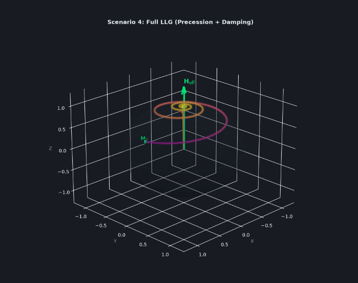

# Landau-Lifshitz-Gilbert (LLG) Equation 3D Visual Explainer

`llg_visual_explainer.py` is a single, self-contained interactive 3D Python desktop GUI application created to teach the fundamentals of the Landau-Lifshitz-Gilbert (LLG) equation to students and beginners in spintronics. By combining precomputed RK45 numerical ODE trajectories with real-time Matplotlib 3D graphics and modern Tkinter UI controls, this application prioritizes visual clarity, intuitive color gradients, and physical precision over lightweight minimalism. It is designed specifically as an interactive conceptual explainer rather than a heavy research-grade micromagnetic simulation suite.

---

## Mathematical Formulation

The **Landau-Lifshitz-Gilbert (LLG) equation** governs the precessional dynamics and magnetic damping of a normalized single-domain macrospin magnetization vector $\mathbf{M}$ ($|\mathbf{M}| = M_s = 1$) under an effective magnetic field $\mathbf{H}_{\text{eff}}$.

### 1. Implicit Gilbert Form
$$\frac{d\mathbf{M}}{dt} = -\gamma (\mathbf{M} \times \mathbf{H}_{\text{eff}}) + \frac{\alpha}{M_s} \left(\mathbf{M} \times \frac{d\mathbf{M}}{dt}\right)$$

Where:
- $\gamma$ is the gyromagnetic ratio.
- $\alpha$ is the dimensionless Gilbert damping constant.
- $-\gamma (\mathbf{M} \times \mathbf{H}_{\text{eff}})$ represents the conservative **precession torque**, forcing $\mathbf{M}$ to precess around the effective field at constant energy.
- $\frac{\alpha}{M_s} (\mathbf{M} \times \frac{d\mathbf{M}}{dt})$ represents the phenomenological **Gilbert damping torque**, dissipating energy and relaxing $\mathbf{M}$ toward alignment with the effective field.


### 2. Explicit Landau-Lifshitz Form (Used for Integration)
By taking the cross product with $\mathbf{M}$ on both sides of the implicit Gilbert equation, we obtain the explicit form suitable for numerical integration:

$$\frac{d\mathbf{M}}{dt} = -\frac{\gamma}{1+\alpha^2} (\mathbf{M} \times \mathbf{H}_{\text{eff}}) - \frac{\gamma \alpha}{(1+\alpha^2) M_s} \mathbf{M} \times (\mathbf{M} \times \mathbf{H}_{\text{eff}})$$

---

## Interactive Conceptual Scenarios

The GUI features four switchable conceptual scenarios to isolate and build intuition for each component of the LLG equation:

1. **`1. Before field applied` ($\mathbf{H}_{\text{eff}} = 0$)**:
   Demonstrates baseline static equilibrium. No effective field is present, so $d\mathbf{M}/dt = 0$ and $\mathbf{M}$ remains fixed at its initial tilted angle ($\theta = 60^\circ$).
2. **`2. Precession only` ($\alpha = 0$)**:
   Damping is set to zero ($\alpha = 0$). $\mathbf{M}$ executes a continuous, closed circular orbit around $\mathbf{H}_{\text{eff}}$ (+z axis) without decaying or losing magnetic energy.
3. **`3. Damping only (conceptual)`**:
   Conceptually isolates the Gilbert damping torque by setting precession to zero. $\mathbf{M}$ relaxes directly along a great-circle meridian arc toward $\mathbf{H}_{\text{eff}}$ without spiraling. *(Note: This isolates one mathematical term for teaching intuition; it does not represent an independent physical real-world state).*
4. **`4. Full LLG (precession + damping)`**:
   Combines precession torque and Gilbert damping torque. $\mathbf{M}$ spirals around $\mathbf{H}_{\text{eff}}$ while gradually relaxing into complete alignment along the $+z$ axis.

---

## Key Features & Visual Quality Polish

- **High-Resolution Unit Sphere**: Rendered with $70 \times 70$ surface mesh tessellation, translucent styling ($\alpha = 0.18$), smooth shading, and equator/meridian reference depth lines.
- **Dynamic Time Gradient Line**: Trajectories are drawn using a continuous `plasma` color gradient representing time progression from initial state ($t=0$) to final state ($t=t_{\text{final}}$).
- **Bold 3D Vector Arrows**: Vivid green quiver arrow for $\mathbf{H}_{\text{eff}}$ along $+z$ and live glowing orange quiver arrow for $\mathbf{M}(t)$.
- **Distinct State Markers**: Bright green sphere marker for initial position $\mathbf{M}_0$, yellow marker for live vector tip, and crimson star marker for final relaxed orientation.
- **Smooth Real-Time Animation**: Powered by non-blocking Tkinter `after()` event loop stepping through precomputed `scipy.integrate.solve_ivp` (RK45) ODE trajectories.
- **Modern UI Styling**: Custom dark slate palette (`#1E222A`), responsive side-panel explanation card, interactive legend, and replay/pause controls.

---

## Installation & Setup

### Prerequisites
- Python 3.8 or higher.
- `pip` package manager.

### 1. Install Dependencies
Install the required core scientific libraries via:

```bash
pip install -r requirements.txt
```

> **Note for Linux Users**: Tkinter comes pre-installed on Windows and macOS. On Linux distributions (e.g., Ubuntu/Debian), if Tkinter is missing, install it via system package manager:
> ```bash
> sudo apt install python3-tk
> ```

---

## How to Run

Execute the main script from your terminal:

```bash
python llg_visual_explainer.py
```

### Application Demo Controls:
- Click any of the **four scenario buttons** in the left panel to instantly launch that scenario's animated 3D trajectory.
- Use **🔄 Replay Animation** to restart the animation from $t=0$.
- Use **⏸ Pause / Resume** to freeze or continue the motion.
- **Webpage-Style 3D Camera Zooming** (Coordinates remain fixed at $[-1.3, 1.3]$ while the 3D scene magnifies/shrinks):
  - **Mouse Scroll Wheel**: Scroll UP / DOWN over the 3D plot canvas to zoom in and out like a camera lens.
  - **UI Zoom Controls**: Click **🎯 Reset View** in the left control panel to reset view zoom and orientation angles.
- Left-click and drag on the 3D plot canvas to interactively rotate the camera perspective angle in real time!

---

## Demonstration Preview


